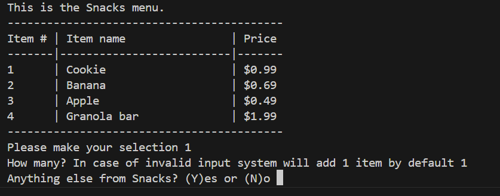
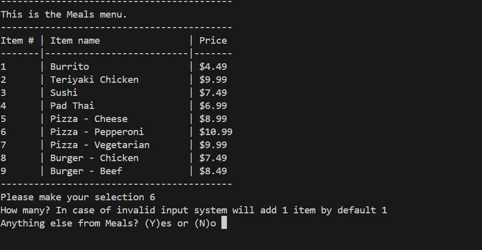
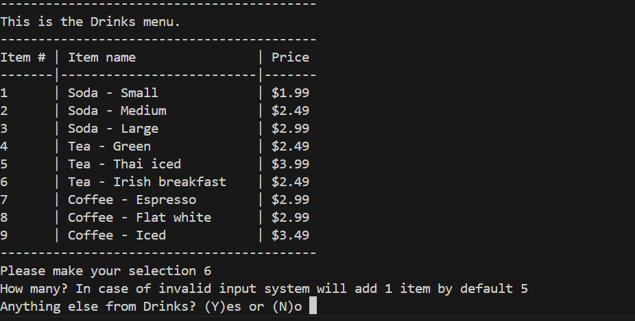

# Design an interactive ordering system from a food truck menu

**Order System**  
***1*** Create an empty list. This list will later store a customer's order in dictionary format, as follows:  
[  
  {  
    "Item name": "string",  
    "Price": float,  
    "Quantity": int  
  },  
  {  
    "Item name": "string",  
    "Price": float,  
    "Quantity": int  
  },  
]  

***2*** After the sub-menu is printed, prompt the customer to enter their selection from the menu , saving it as a variable ***menu_selection***  

***3*** Use input validation to check if the customer input ***menu_selection*** is a number. If it isn't, print an error message. If it is a number, convert the input to an integer and use it to check if it is in the keys of ***menu_items***.  

***4*** If the user input is not in the menu_items keys, print an error. Otherwise, perform the following actions:

Get the item name from the ***menu_items*** dictionary and store it as a variable.

Ask the customer for the quantity of the menu item, using the item name variable in the question, and let them know that the quantity will default to 1 if their input is invalid. Save their answer as a variable called ***quantity***.

Check that the customer input is a number. If it isn't, set the ***quantity*** to the value 1. If it is a number, convert the variable to an integer.

Append the customer's order to the order list in dictionary format with the following keys: ***"Item name"***, ***"Price"***, and ***"Quantity"***. You will need this information to print the receipt at the end of the order. The price should be found in the ***menu_items*** dictionary.  

***5*** Inside the continuous while loop that prompts the customer if they would like to keep ordering, write a match:case statement that checks for y or n (upper or lowercase), and includes a default option if neither letter is entered by the customer. The following actions should be performed for each case:

y: Set the ***place_order*** variable to ***True*** and break from the continuous while loop.  

n: Set the ***place_order*** variable to ***False***, print "Thank you for your order", and break from the continuous while loop.  

Default: Tell the customer to try again because they didn't type a valid input.  

**Order Receipt**

***6*** Create a for loop to loop through the order list.  

***7*** Inside the loop, save the value of each key as their own variable: item_name, price, and quantity.

***8*** Calculate the number of empty spaces that should be added to the display so that the receipt uses the following format:  

Item name                 | Price  | Quantity
--------------------------|--------|----------
Apple                     | $0.49  | 1
Tea - Thai iced           | $3.99  | 2
Fried banana              | $4.49  | 3  

***9*** Create the space strings as their own variables using string multiplication.  

***10*** Print the line for the receipt using the format in Step 8.  

***11*** Upon exiting the for loop, use list comprehension and sum() to calculate the total price of the order and display it to the customer. Make sure you multiply the price by the quantity in your list comprehension.  

***Confirmation to exit submenu Snacks**  
  

***Confirmation to exit submenu Meals**  
  

***Confirmation to exit submenu Drinks**  
  

***confirmation to exit submenu Deserts**  
  

***OUTPUT**  
  